|repo||
|-|-|
  ||https://github.com/mermaid-js/mermaid|
|参考||
||https://fairplus.github.io/the-fair-cookbook/1/mermaidsetup.html|
|jekyll-mermaid||
||https://github.com/jasonbellamy/jekyll-mermaid|
|usage||
||https://mermaid-js.github.io/mermaid/#/|


# 記法
### ノード（接続点）
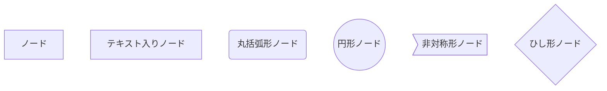

graph TD
    ノード
    ノード1[テキスト入りノード]
    ノード2(丸括弧形ノード)
    ノード3((円形ノード))
    ノード4>非対称形ノード]
    ノード5{ひし形ノード}

### リンク（接続）

|矢印付きリンク||
|オープンリンク||
|リンク上テキスト||
|矢印とテキストのリンク||
|点線リンク||
|点線リンク上テキスト||
|太線リンク||
|太線上のテキスト||
|特殊文字コード使用||
|特殊文字詳細は、こちら||
|特殊文字変換ツールはこちら||
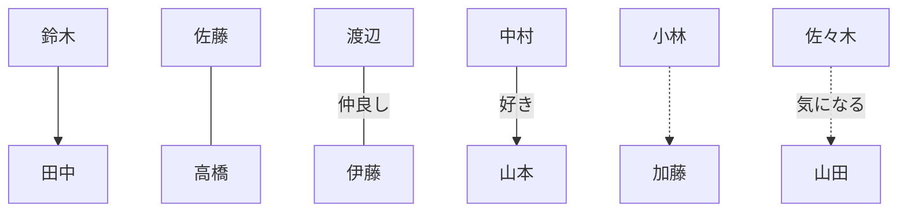

graph TD
    鈴木-->田中
    佐藤---高橋
    渡辺---|仲良し|伊藤
    中村-->|好き|山本
    小林-.->加藤
    佐々木-.気になる.->山田


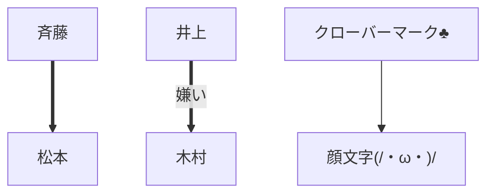

graph TD
    斉藤==>松本
    井上==嫌い==>木村
    A["クローバーマーク&clubs;"] -->B["顔文字(/・&omega;・)/"]

#### サブグラフ
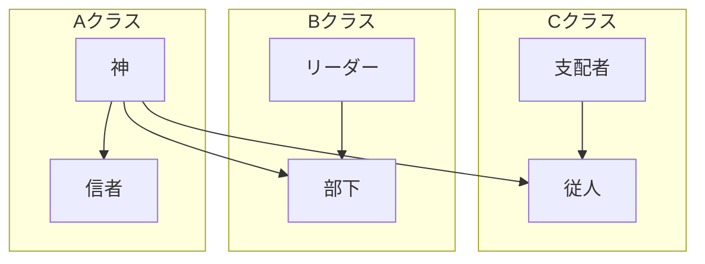

graph TB
    神-->従人
    神-->部下
    subgraph Cクラス
    支配者-->従人
    end
    subgraph Bクラス
    リーダー-->部下
    end
    subgraph Aクラス
    神-->信者
    end
{% endhighlight}

#### 動き
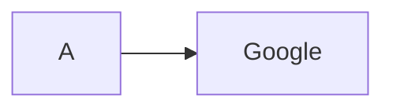

graph LR
    A-->Google
    click A callback "クリック"
    click Google "https://www.google.co.jp/" "リンク指定"
{% endhighlight}
#### スタイル指定
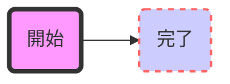

graph LR
    start(開始)-->stop(完了)
    style start fill:#f9f,stroke:#333,stroke-width:4px
    style stop fill:#ccf,stroke:#f66,stroke-width:2px,stroke-dasharray: 5, 5
{% endhighlight}
### フローチャート
フローチャートを作成の際には、「graph タイプ」で指定
指定タイプは、下記。

TB - 上から下
BT - 下から上
RL - 右から左
LR - 左から右
下記は、上から下への流れを示すフローチャート
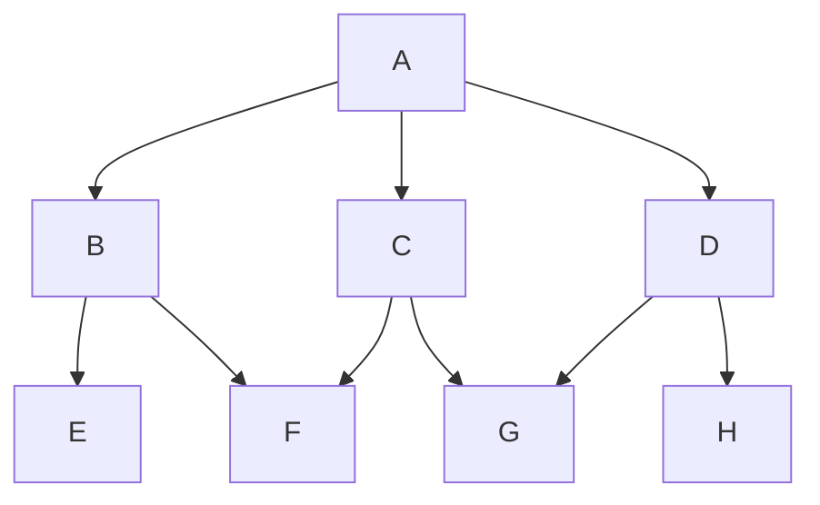

graph TB
    A-->B
    A-->C
    A-->D

    B-->E
    B-->F

    C-->F
    C-->G

    D-->G
    D-->H

下記は、左から右への流れを示すフローチャート
※同じノード（接続点）があれば、自動的に流れを示す。
graph LR
    A-->B
    B-->C
    C-->D
    D-->E
    E-->F
    F-->G
    G-->H
    H-->I

    I-->A
image.png

### シーケンス図
#### 最初に「sequenceDiagram」を指定する。
sequenceDiagram
    クライアント->>サーバー: 要求
    サーバー-->>クライアント: 送信
image.png

#### ライフライン（参加者）を定義することもできる。
#### エイリアス（変数や名前）を指定することもできる。
sequenceDiagram
    participant クライアント
    participant sv as サーバー
    participant db as データベース

    # データ取得コード
    クライアント ->> sv : 要求
    sv ->> db : 発行
    db -->> sv : 結果
    sv -->> クライアント : 結果

    alt 正常終了
        Note over クライアント : 取得データ表示
    else エラー
        Note over クライアント : エラー表示
    end
image.png

実行仕様（イベント）を追加できる。
sequenceDiagram
    クライアント->>+サーバー: 要求
    サーバー-->>-クライアント: 送信
image.png

ノート（メモ）を追加できる。
sequenceDiagram
    クライアント->>+サーバー: 要求
    Note right of サーバー: これは基本処理です
    サーバー-->>-クライアント: 送信
image.png

sequenceDiagram
    クライアント->>+サーバー: 要求
    Note over クライアント,サーバー: きちんと返してくれるかな。
    サーバー-->>-クライアント: 送信
image.png

#### ループ表現可能
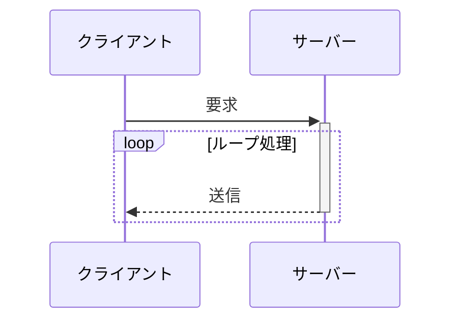

sequenceDiagram
    クライアント->>+サーバー: 要求
    loop ループ処理
        サーバー-->>-クライアント: 送信
    end

#### 条件分岐可能
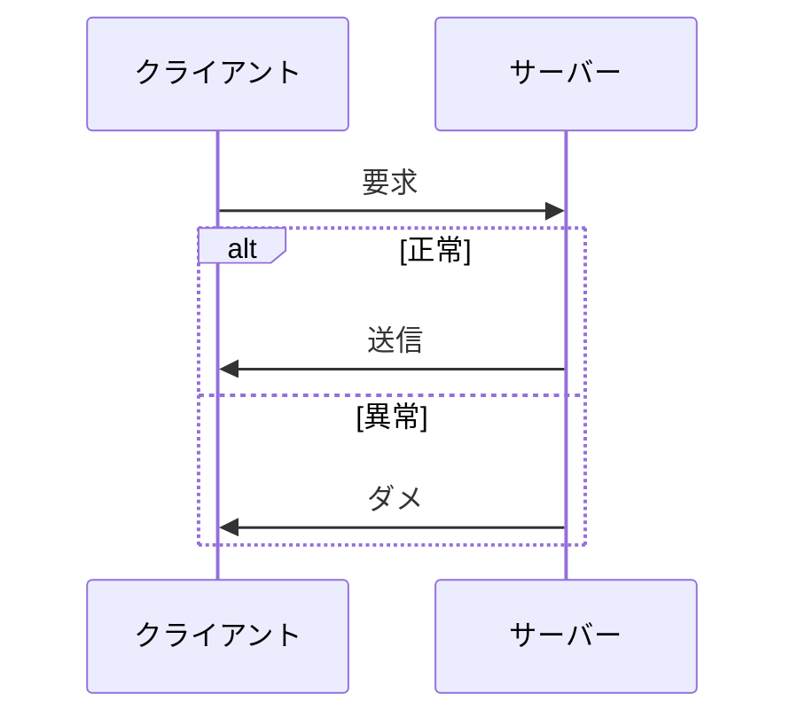

sequenceDiagram
    participant cl as クライアント
    participant sv as サーバー
    cl->>sv: 要求
    alt 正常
        sv->>cl: 送信
    else 異常
        sv->>cl: ダメ
    end

### ガントチャート
最初に「gant」を指定する。
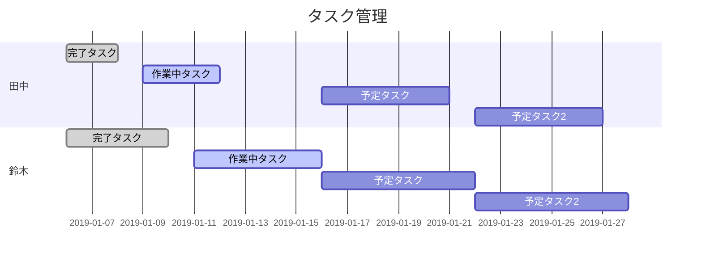

gantt
    dateFormat  YYYY-MM-DD
    title タスク管理

    section 田中
    完了タスク            :done,    des1, 2019-01-06,2019-01-08
    作業中タスク               :active,  des2, 2019-01-09, 3d
    予定タスク               :         des3, after des2, 5d
    予定タスク2              :         des4, after des3, 5d

    section 鈴木
    完了タスク            :done,    des1, 2019-01-06,2019-01-10
    作業中タスク               :active,  des2, 2019-01-11, 5d
    予定タスク               :         des3, after des2, 6d
    予定タスク2              :         des4, after des3, 6d

参考
https://mermaidjs.github.io/
→mermaidの公式サイトです。こちらの記事で調査しました。大変お世話になりました。
https://qiita.com/rana_kualu/items/da394fd33ce019bf0ba7

{% include blogcard.html site="qiita.com" url="https://qiita.com/t_o_d/items/ac5b04419252f768a535" image="https://qiita-user-contents.imgix.net/https%3A%2F%2Fcdn.qiita.com%2Fassets%2Fpublic%2Farticle-ogp-background-1150d8b18a7c15795b701a55ae908f94.png?ixlib=rb-1.2.2&w=1200&mark=https%3A%2F%2Fqiita-user-contents.imgix.net%2F~text%3Fixlib%3Drb-1.2.2%26w%3D840%26h%3D380%26txt%3D%25E3%2580%2590%25E7%259B%25AE%25E7%259A%2584%25E7%2584%25A1%25E3%2581%2597%25E3%2581%25AE%25E6%25B3%25A5%25E8%2587%25AD%25E8%25AA%25BF%25E6%259F%25BB%25E2%2591%25A4%25E3%2580%2591mermaid.js%25E3%2581%25AE%25E8%25A8%2598%25E6%25B3%2595%25E3%2582%2592%25E8%25A6%259A%25E3%2581%2588%25E3%2581%25A6%25E3%2580%2581%25E6%25A5%25BD%25E3%2581%2597%25E3%2581%258F%25E5%259B%25B3%25E3%2582%2592%25E6%258F%258F%25E3%2581%258F%25E3%2580%2582%26txt-color%3D%2523333%26txt-font%3DHiragino%2520Sans%2520W6%26txt-size%3D54%26txt-clip%3Dellipsis%26txt-align%3Dcenter%252Cmiddle%26s%3D8260106dc5522c35db916ebe8c24917c&mark-align=center%2Cmiddle&blend=https%3A%2F%2Fqiita-user-contents.imgix.net%2F~text%3Fixlib%3Drb-1.2.2%26w%3D840%26h%3D500%26txt%3D%2540t_o_d%26txt-color%3D%2523333%26txt-font%3DHiragino%2520Sans%2520W6%26txt-size%3D45%26txt-align%3Dright%252Cbottom%26s%3D5046684b518710ebbcad332f5b9362ef&blend-align=center%2Cmiddle&blend-mode=normal&s=947bbfa5cb11091ae72d6b422355a709" title="【目的無しの泥臭調査⑤】mermaid.jsの記法を覚えて、楽しく図を描く。 - Qiita" desc=" ふと気になったことを、淡々と赴くままに調査していく、この上ない自己満足記事第五弾。 効率的な学習ぶりの華麗で綺麗な振る舞いの「世の多くの賢人技術者」とは違い、ひたすらに画面遷移と手書き記録を高速回転しながら、心身共に泥まみれの学習ぶ..." %}

サイトのデモソースをちゃんと追ったら、numberSectionStylesを1以上に設定したら、色設定がされるようになった。


mermaid.ganttConfig ={
    numberSectionStyles: 3 // 0:モノクロ, 1以上:色分けあり。数字は色分けするセクションの数。
};
<<<<<<< HEAD

{% include blogcard.html site="qiita.com" url="https://qiita.com/caesar_cat/items/e8a116a585863633d15a" image="https://qiita-user-contents.imgix.net/https%3A%2F%2Fcdn.qiita.com%2Fassets%2Fpublic%2Farticle-ogp-background-1150d8b18a7c15795b701a55ae908f94.png?ixlib=rb-1.2.2&w=1200&mark=https%3A%2F%2Fqiita-user-contents.imgix.net%2F~text%3Fixlib%3Drb-1.2.2%26w%3D840%26h%3D380%26txt%3Dmermaid.js%2520%25E3%2581%25A7%25E4%25B8%258A%25E6%25B5%2581%25E5%25B7%25A5%25E7%25A8%258B%25E3%2582%2592%25E5%25A5%25BD%25E3%2581%258D%25E3%2581%25AB%25E3%2581%25AA%25E3%2582%258D%25E3%2581%2586%26txt-color%3D%2523333%26txt-font%3DHiragino%2520Sans%2520W6%26txt-size%3D54%26txt-clip%3Dellipsis%26txt-align%3Dcenter%252Cmiddle%26s%3D448b9e547e9107c55a52dd748be00c88&mark-align=center%2Cmiddle&blend=https%3A%2F%2Fqiita-user-contents.imgix.net%2F~text%3Fixlib%3Drb-1.2.2%26w%3D840%26h%3D500%26txt%3D%2540caesar_cat%26txt-color%3D%2523333%26txt-font%3DHiragino%2520Sans%2520W6%26txt-size%3D45%26txt-align%3Dright%252Cbottom%26s%3D814fca679a746792fffd0804127eb5a8&blend-align=center%2Cmiddle&blend-mode=normal&s=d26ce78d34145764e060701aecf994ce" title="mermaid.js で上流工程を好きになろう - Qiita" desc="   はじめに  立場上、数週間コードを書かずにパワポや Excel の仕様書を作るような上流工程を担当することが増えてきました。 もちろんそれはそれで大事なお仕事ですしそれなりにやり甲斐はありますが、クリックだけでポチポチと動かない..." %}

### フローチャート
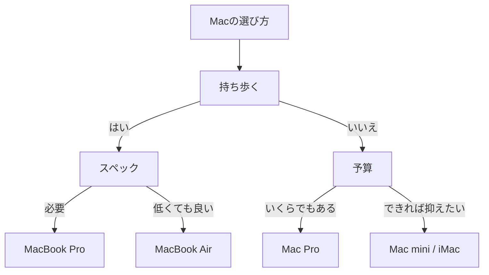

graph TB
  Macの選び方 --> 持ち歩く
  持ち歩く -->|はい| スペック
  持ち歩く -->|いいえ| 予算
  スペック -->|必要| R1[MacBook Pro]
  スペック -->|低くても良い| R2[MacBook Air]
  予算 --> |いくらでもある| R3[Mac Pro]
  予算 --> |できれば抑えたい| R4[Mac mini / iMac]

### クラス図・エンティティ図
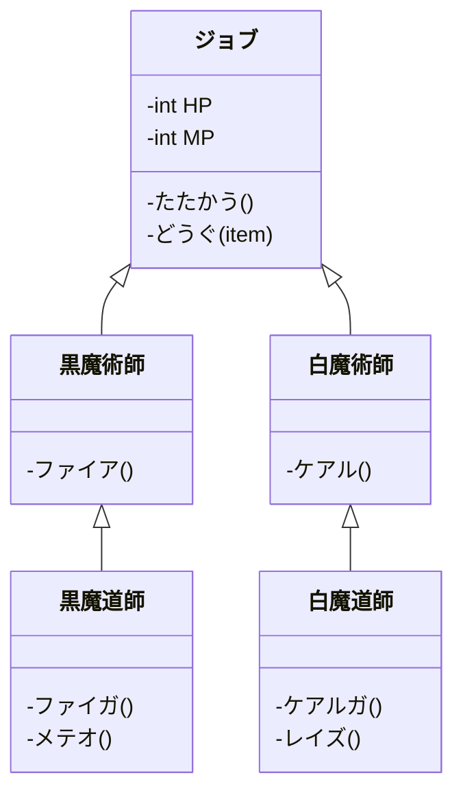

classDiagram
  class ジョブ{
    -int HP
    -int MP
    -たたかう()
    -どうぐ(item)
  }
  class 黒魔術師{
    -ファイア()
  }
  class 黒魔道師{
    -ファイガ()
    -メテオ()
  }
  class 白魔術師{
    -ケアル()
  }
  class 白魔道師{
    -ケアルガ()
    -レイズ()
  }
  黒魔術師 <|-- 黒魔道師
  白魔術師 <|-- 白魔道師
  ジョブ <|-- 黒魔術師
  ジョブ <|-- 白魔術師

###状態遷移図
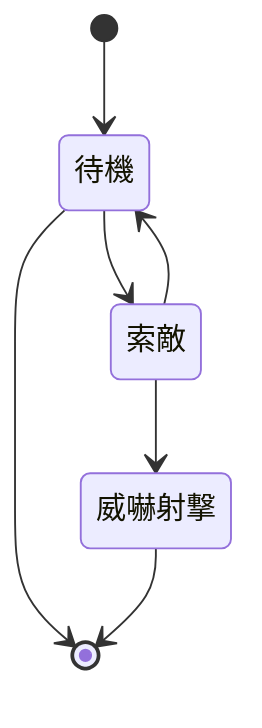

stateDiagram
  [*] --> 待機
  待機 --> [*]
  待機 --> 索敵
  索敵 --> 待機
  索敵 --> 威嚇射撃
  威嚇射撃 --> [*]

### ガントチャート
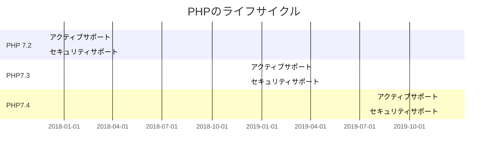

gantt
  title PHPのライフサイクル

  section PHP 7.2
    アクティブサポート      : done, 2017-11-30, 2019-11-30
    セキュリティサポート     : crit, 2020-11-30

  section PHP7.3
    アクティブサポート      : 2018-12-06, 2020-12-06
    セキュリティサポート     : crit, 2021-12-06

  section PHP7.4
    アクティブサポート      : 2019-11-28, 2021-11-28
    セキュリティサポート     : crit, 2022-11-28


### 円グラフ
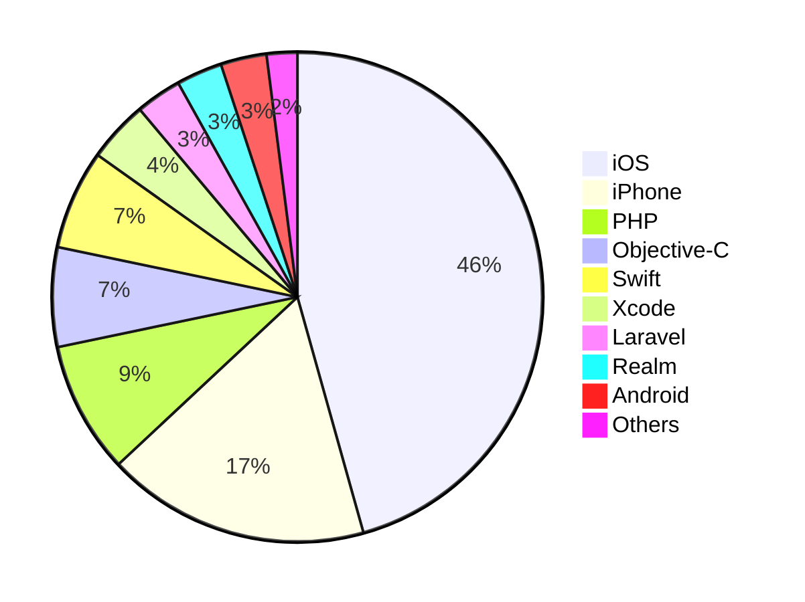

pie
  "iOS": 45.2
  "iPhone": 17.2
  "PHP": 8.6
  "Objective-C": 6.5
  "Swift": 6.5
  "Xcode": 4
  "Laravel": 3
  "Realm": 3
  "Android": 3
  "Others": 2
=======

>>>>>>> 24a8fb3... mermaid example

{% include blogcard.html site="qiita.com" url="https://qiita.com/caesar_cat/items/e8a116a585863633d15a" image="https://qiita-user-contents.imgix.net/https%3A%2F%2Fcdn.qiita.com%2Fassets%2Fpublic%2Farticle-ogp-background-1150d8b18a7c15795b701a55ae908f94.png?ixlib=rb-1.2.2&w=1200&mark=https%3A%2F%2Fqiita-user-contents.imgix.net%2F~text%3Fixlib%3Drb-1.2.2%26w%3D840%26h%3D380%26txt%3Dmermaid.js%2520%25E3%2581%25A7%25E4%25B8%258A%25E6%25B5%2581%25E5%25B7%25A5%25E7%25A8%258B%25E3%2582%2592%25E5%25A5%25BD%25E3%2581%258D%25E3%2581%25AB%25E3%2581%25AA%25E3%2582%258D%25E3%2581%2586%26txt-color%3D%2523333%26txt-font%3DHiragino%2520Sans%2520W6%26txt-size%3D54%26txt-clip%3Dellipsis%26txt-align%3Dcenter%252Cmiddle%26s%3D448b9e547e9107c55a52dd748be00c88&mark-align=center%2Cmiddle&blend=https%3A%2F%2Fqiita-user-contents.imgix.net%2F~text%3Fixlib%3Drb-1.2.2%26w%3D840%26h%3D500%26txt%3D%2540caesar_cat%26txt-color%3D%2523333%26txt-font%3DHiragino%2520Sans%2520W6%26txt-size%3D45%26txt-align%3Dright%252Cbottom%26s%3D814fca679a746792fffd0804127eb5a8&blend-align=center%2Cmiddle&blend-mode=normal&s=d26ce78d34145764e060701aecf994ce" title="mermaid.js で上流工程を好きになろう - Qiita" desc="   はじめに  立場上、数週間コードを書かずにパワポや Excel の仕様書を作るような上流工程を担当することが増えてきました。 もちろんそれはそれで大事なお仕事ですしそれなりにやり甲斐はありますが、クリックだけでポチポチと動かない..." %}
